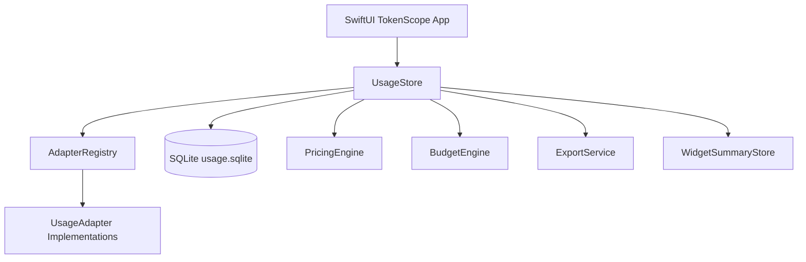

# TokenScope v1.0.0

**TokenScope** is a local-first native macOS application for tracking AI coding and chat tool token usage, estimated cost, trends, budgets, and data source status.

It is designed for developers who use multiple AI agents and want one private dashboard for usage visibility across tools such as **Claude Code**, **Codex / CodeX**, **Hermes**, and **OpenClaw**.

> Version: `1.0.0`  
> Platform: macOS 14+  
> UI: SwiftUI  
> Storage: SQLite  
> Distribution: `.app` bundle

---

## Screens and Capabilities

TokenScope v1.0.0 includes the following major screens:

- **Dashboard** — token totals, estimated cost, trends, budget progress, recent usage, and tool distribution.
- **Usage Details** — searchable usage table with source, account, API key identity, model, token counts, and estimated cost.
- **Data Sources** — local data source configuration, enable/disable state, sync status, and error messages.
- **Accounts** — account/API key identity overview with masked values.
- **Pricing** — editable model pricing with manual add/update support.
- **Budgets** — editable daily/weekly/monthly token and cost budgets.
- **Export / Import** — CSV/JSON export preview and JSON import service foundation.
- **Settings** — menu bar display mode, privacy notes, and local data clearing.
- **Widgets Guide** — WidgetKit integration notes and shared summary generation.
- **Menu Bar Mini Panel** — quick today/week/month usage and refresh access.

---

## Highlights

### Local-first by default

TokenScope does not upload usage data. It reads local logs and local databases, stores normalized records locally, and performs all aggregation on-device.

### Multi-tool usage tracking

Supported adapters in v1.0.0:

| Tool | Source | Current status |
|---|---|---|
| Claude Code | `~/.claude/projects/**/*.jsonl` | Parses Claude assistant usage records when non-zero usage exists |
| Codex / CodeX | `~/.codex/sessions/**/*.jsonl`, `~/.codex/archived_sessions/*.jsonl` | Parses Codex `token_count` events |
| Hermes | `~/.hermes/state.db` | Parses structured SQLite `sessions` usage data |
| OpenClaw | `~/.openclaw/agents/*/sessions/*.jsonl` | Parses OpenClaw message usage records when non-zero usage exists |

### SQLite persistence

TokenScope stores normalized data in:

```text
~/Library/Application Support/TokenScope/usage.sqlite
```

SQLite tables:

- `usage_records`
- `model_pricing`
- `budget_rules`

Historical usage remains available even if an account, API key, or source log is later removed.

### Pricing and cost estimation

Costs are estimated using per-million-token prices:

```text
cost = inputTokens / 1_000_000 * inputPrice
     + outputTokens / 1_000_000 * outputPrice
     + cacheTokens / 1_000_000 * cachePrice
```

Users can manually add or update pricing for any model in the **Pricing** page. Pricing is persisted to SQLite.

When a data source already provides cost data, TokenScope can preserve that source-provided cost. For example, Hermes records `estimated_cost_usd` in its local SQLite database.

### Budget tracking

Budgets can be configured for:

- Daily token budget
- Daily cost budget
- Weekly token budget
- Weekly cost budget
- Monthly token budget
- Monthly cost budget

Budget settings are persisted to SQLite.

Budget progress can be displayed in two modes inside the app:

- **Tokens mode** — progress = used total tokens / token budget.
- **Cost mode** — progress = estimated cost / cost budget.

The Dashboard/Budgets budget radar includes a segmented switch for choosing the active progress calculation mode.

Alert levels:

- `< 80%` — normal
- `80%–99.99%` — warning
- `>= 100%` — exceeded

### Sci-fi SwiftUI design

The UI uses a light sci-fi glassmorphism dashboard style with neon cyan/blue/purple accents and system appearance support.

### Menu bar support

TokenScope includes a macOS `MenuBarExtra` mini panel. The menu bar can show either today's tokens or today's estimated cost.

### WidgetKit source included

A WidgetKit implementation draft is included under:

```text
TokenScopeWidgets/
```

Swift Package Manager does not build WidgetKit extensions directly, so the widget source is intended to be added to an Xcode Widget Extension target with App Groups enabled.

---

## Install the App Bundle

TokenScope v1.0.0 can be packaged as a regular macOS `.app` bundle at:

```text
dist/TokenScope.app
```

To install locally, copy or drag `TokenScope.app` into `/Applications`, then launch it from Applications or Spotlight.

> The current build is ad-hoc signed for local installation. For public distribution, use an Apple Developer ID certificate and notarization.

---

## Build from Source

### Requirements

- macOS 14+
- Swift 6+
- Command Line Tools or Xcode
- `hdiutil` is optional and only needed if you manually create DMG images
- `codesign` for local signing

Check tool availability:

```bash
swift --version
command -v hdiutil
command -v codesign
```

### Build the app

```bash
swift build
```

### Run the app

```bash
swift run TokenScope
```

### Build release

```bash
swift build -c release --product TokenScope
```

---

## Create an App Bundle

TokenScope includes an app-bundle packaging script:

```text
packaging/build_app.sh
```

Run:

```bash
packaging/build_app.sh
```

Output:

```text
dist/TokenScope.app
```

The script performs:

1. Release build with SwiftPM
2. `.app` bundle creation
3. `Info.plist` generation
4. simple `.icns` icon generation
5. ad-hoc signing

---

## Development Commands

### Build

```bash
swift build
```

### Run core verification runner

This repository includes `TokenScopeCoreTestsRunner` because some Command Line Tools environments may not provide a working XCTest or Swift Testing runtime.

```bash
swift run TokenScopeCoreTestsRunner
```

Expected output for v1.0.0:

```text
TokenScopeCoreTestsRunner: 15 checks passed
```

### Smoke test local adapters

```bash
swift run TokenScopeSmoke
```

This performs a real local refresh using the default adapter paths and prints synchronized record counts.

### Build App Bundle

```bash
packaging/build_app.sh
```

---

## Project Structure

```text
TokenScope/
├── Package.swift
├── Sources/
│   ├── TokenScopeApp/
│   │   ├── App.swift
│   │   ├── Theme/
│   │   └── Views/
│   ├── TokenScopeCore/
│   │   ├── Adapters/
│   │   ├── Models/
│   │   ├── Services/
│   │   └── Storage/
│   ├── TokenScopeCoreTestsRunner/
│   └── TokenScopeSmoke/
├── Tests/
│   └── TokenScopeTests/
├── TokenScopeWidgets/
├── docs/
│   └── ARCHITECTURE.md
├── packaging/
│   ├── build_dmg.sh
│   └── README.md
└── dist/
    └── TokenScope.app
```

---

## Architecture

TokenScope is split into a SwiftUI app shell and a testable core module.



### Core models

Important model types:

- `UsageRecord`
- `UsageSource`
- `Account`
- `APIKeyIdentity`
- `ModelPricing`
- `BudgetRule`
- `AggregatedUsage`
- `TrendBucket`
- `SyncStatus`
- `WidgetSummary`

### Adapter protocol

All data sources conform to `UsageAdapter`:

```swift
public protocol UsageAdapter: Sendable {
    var id: String { get }
    var tool: ToolKind { get }
    var displayName: String { get }
    var capabilities: AdapterCapabilities { get }
    func refresh(source: UsageSource, pricing: [ModelPricing]) async throws -> [UsageRecord]
}
```

Adding a new source such as Cursor, OpenAI, Gemini, DeepSeek, or Anthropic Console should be done by adding a new adapter and registering it in `AdapterRegistry`.

---

## Data Sources

### Hermes

TokenScope reads Hermes usage from:

```text
~/.hermes/state.db
```

Primary fields:

- `sessions.model`
- `sessions.input_tokens`
- `sessions.output_tokens`
- `sessions.cache_read_tokens`
- `sessions.cache_write_tokens`
- `sessions.estimated_cost_usd`
- `sessions.billing_provider`

### Codex / CodeX

TokenScope reads Codex JSONL session logs from:

```text
~/.codex/sessions/**/*.jsonl
~/.codex/archived_sessions/*.jsonl
```

Primary event:

```json
{
  "type": "event_msg",
  "payload": {
    "type": "token_count",
    "info": {
      "last_token_usage": {
        "input_tokens": 0,
        "cached_input_tokens": 0,
        "output_tokens": 0,
        "reasoning_output_tokens": 0
      }
    }
  }
}
```

### Claude Code

TokenScope reads Claude Code project logs from:

```text
~/.claude/projects/**/*.jsonl
```

Primary fields:

- `message.model`
- `message.usage.input_tokens`
- `message.usage.output_tokens`
- `message.usage.cache_creation_input_tokens`
- `message.usage.cache_read_input_tokens`

### OpenClaw

TokenScope reads OpenClaw logs from:

```text
~/.openclaw/agents/*/sessions/*.jsonl
```

Primary fields:

- `message.model`
- `message.provider`
- `message.usage.input`
- `message.usage.output`
- `message.usage.cacheRead`
- `message.usage.cacheWrite`
- `message.usage.cost.total`

---

## Privacy and Security

- TokenScope reads local files and local SQLite databases only.
- No telemetry upload path exists in v1.0.0.
- API keys are never required for local usage parsing.
- UI displays only account/API identity labels or masked values.
- `KeychainService` is included for secure API key storage workflows.
- Export UI defaults to redacted account/API identifiers.

---

## Known Limitations in v1.0.0

- Codex/CodeX token counts are parsed from real local logs, but model attribution is currently normalized as `codex` for performance and reliability.
- Claude Code and OpenClaw may show zero records if their local logs contain only zero-usage or failed assistant events.
- WidgetKit source is included, but the widget is not built by SwiftPM; it must be added to an Xcode Widget Extension target.
- The app is ad-hoc signed by the packaging script and is not notarized.
- Some settings are implemented for local workflows first and may need additional polishing for public distribution.

---

## Roadmap

Possible next steps:

- Persist data source settings and account configuration.
- Improve Codex model attribution with per-rollout metadata caching.
- Add first-class CSV import UI.
- Add SQLite-backed export history.
- Add real WidgetKit extension target in an Xcode project.
- Add Apple Developer ID signing and notarization.
- Add Cursor, OpenAI, Gemini, DeepSeek, and Anthropic Console adapters.
- Add local notification alerts for budget thresholds.

---

## License

No license has been selected yet. Before publishing as an open-source project, add a license file such as `MIT`, `Apache-2.0`, or `GPL-3.0`.

---

## Maintainer Notes

This v1.0.0 README describes the current SwiftPM-based implementation. The project can be developed and packaged without Xcode, but an Xcode project will be useful for production-grade WidgetKit, entitlements, notarization, and App Group configuration.
