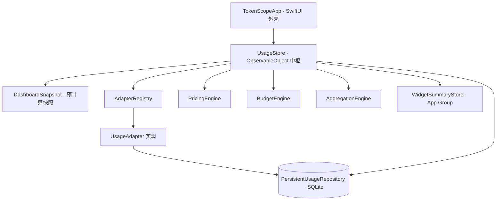

# TokenScope

> 本地优先（local-first）的原生 macOS 应用,用于统计本地多个 AI 编码 / 对话工具的 **Token 用量、估算费用、趋势与预算**。所有数据只在本机读取与聚合,**没有任何上传通道**。
>
> A local-first native macOS app that tracks token usage, cost, trends and budgets across local AI coding/chat tools — read-only, on-device, no upload path.

<p>
  
  
  
  
  
</p>

---

## 目录

- [它是什么](#它是什么)
- [核心特性](#核心特性)
- [支持的工具与数据源](#支持的工具与数据源)
- [安装](#安装)
- [从源码构建](#从源码构建)
- [开发与测试命令](#开发与测试命令)
- [架构](#架构)
- [数据存储、去重与增量同步](#数据存储去重与增量同步)
- [费用估算与预算](#费用估算与预算)
- [性能](#性能v101)
- [隐私与安全](#隐私与安全)
- [项目结构](#项目结构)
- [版本历史](#版本历史)
- [已知限制 / 路线图](#已知限制--路线图)
- [许可证](#许可证)

---

## 它是什么

**TokenScope** 面向同时使用多个 AI Agent / CLI 工具的开发者,把分散在各工具本地日志、数据库里的 token 用量,汇总成一个**统一的、私密的**可视化面板:今日 / 本周 / 本月用量、估算花费、趋势图、工具分布、预算进度和最近明细。

它**只读取本地文件和本地 SQLite 数据库**,在本机完成全部归一化与聚合,不需要任何 API Key 即可统计用量。界面采用浅色科幻玻璃拟态(glassmorphism)风格,并提供菜单栏迷你面板与 WidgetKit 小组件源码。

> 界面文案、枚举 `rawValue`、同步状态等均为**中文**,且部分中文字符串是持久化到 SQLite 的主键(见 [架构](#架构) 的约定说明)。

---

## 核心特性

- **多工具统一统计** —— 一次性汇总 Claude Code、Codex、Hermes、OpenClaw、OpenCode 五个工具的用量。
- **本地优先,零上传** —— 仅读取本地日志 / SQLite,数据保存在本机,无遥测、无上传路径。
- **增量同步** —— 通过游标(cursor)记录每个文件的续读位置,默认只解析新增内容,避免每次全量重扫;也支持一键全量重读。
- **SQLite 持久化** —— 归一化记录、价格、预算、游标均落地 SQLite(WAL 模式);记录与账号/源解耦,删除源后历史用量依旧保留。
- **费用估算** —— 按「美元 / 百万 token」估算;若数据源本身提供费用(如 Hermes、OpenClaw、OpenCode),优先采用源费用。
- **预算雷达** —— 每日 / 每周 / 每月的 token 与费用预算,支持「按 Token」或「按费用」两种进度口径,80% / 100% 分级提醒。
- **趋势与分布** —— 按小时 / 天 / 月分桶的趋势图,工具分布与缓存命中率。
- **菜单栏 + 小组件** —— `MenuBarExtra` 迷你面板(可显示今日 token 或今日费用);随附 WidgetKit 小组件源码。
- **导出** —— CSV / JSON 导出,**默认脱敏**账号 / API Key 标识。

---

## 支持的工具与数据源

当前内置 **5** 个工具适配器:

| 工具 | 数据源 | 类型 |
|---|---|---|
| **Claude Code** | `~/.claude/projects/**/*.jsonl` | JSONL 逐行解析 |
| **Codex** | `~/.codex/sessions/**/*.jsonl`、`~/.codex/archived_sessions/*.jsonl` | JSONL（`token_count` 事件） |
| **Hermes** | `~/.hermes/state.db` | SQLite（`sessions` 表，含 `estimated_cost_usd`） |
| **OpenClaw** | `~/.openclaw/agents/*/sessions/*.jsonl` | JSONL（含 `usage.cost.total`） |
| **OpenCode** | `~/.local/share/opencode/opencode.db` | SQLite（消息行，含 cost 字段） |

> 想新增工具(Cursor / OpenAI / Gemini …):在 `Models.swift` 增加 `ToolKind` case → 实现适配器 → 在 `AdapterRegistry` 注册 → 在 `UsageStore.defaultPricing()` 补默认价格。JSONL 类工具可直接复用 `LocalJSONLUsageAdapter`(传入一个解析闭包)。

---

## 安装

### 方式一:从 Release 下载(推荐普通用户)

1. 到 [Releases](https://github.com/BennettL569/Token-UI-TokenScope/releases) 下载最新版的 `TokenScope-<version>.dmg` 或 `TokenScope-<version>-macOS.zip`。
2. 打开 `.dmg`,把 `TokenScope.app` 拖入「应用程序」;或解压 zip 后拖入「应用程序」。
3. **首次打开**:该构建为本地 **ad-hoc 签名、未经 Apple 公证**,Gatekeeper 可能拦截。请**右键点击 App → 打开**(只需一次),或在终端执行:

   ```bash
   xattr -dr com.apple.quarantine /Applications/TokenScope.app
   ```

> 要求 **macOS 14+**。应用为**非沙盒**构建,以便读取 `~/.claude`、`~/.codex` 等本地日志。

### 方式二:自行构建并安装

```bash
git clone https://github.com/BennettL569/Token-UI-TokenScope.git
cd Token-UI-TokenScope
packaging/build_app.sh          # 产出 dist/TokenScope.app(release、ad-hoc 签名、非沙盒)
cp -R dist/TokenScope.app /Applications/
```

---

## 从源码构建

### 环境要求

- macOS 14+
- Swift 6（`swift-tools-version: 6.0`）—— Xcode 或 Command Line Tools
- 链接系统 `sqlite3`(已在 `Package.swift` 中配置)
- 打 DMG 需要 `hdiutil`、签名需要 `codesign`(macOS 自带)

```bash
swift --version
```

### 构建与运行

```bash
swift build                                  # debug 构建全部产物
swift run TokenScope                          # 运行 App(非沙盒,可读取 ~/.claude 等)
swift build -c release --product TokenScope   # release 构建
```

### 打包

```bash
packaging/build_app.sh    # → dist/TokenScope.app（release + .icns + ad-hoc 签名，非沙盒/未公证）
packaging/build_dmg.sh    # → dist/TokenScope-<version>.dmg（带 /Applications 拖拽符号链接）
```

> WidgetKit 扩展**不能**由 SwiftPM 构建。仓库内的 `TokenScope.xcodeproj` 镜像了同一套源码,是构建 `TokenScopeWidgetsExtension` 的**唯一**途径。注意:Xcode 构建会启用 App Sandbox(仅 `files.user-selected.read-only`),沙盒下主目录日志适配器无法读取——这也是 `swift run` / `build_app.sh` 产出**非沙盒**二进制的原因。

---

## 开发与测试命令

仓库有**两套覆盖同一逻辑的测试**(修改核心逻辑时需同步更新两者):

```bash
# 1) 手写的快速校验器(不依赖 XCTest/Swift Testing 运行时)
swift run TokenScopeCoreTestsRunner
#    预期输出: TokenScopeCoreTestsRunner: 21 checks passed

# 2) Swift Testing 套件
swift test
swift test --filter aggregationFiltersToday   # 跑单个测试

# 3) 针对真实本地数据源的冒烟测试(跑两遍以验证增量同步)
swift run TokenScopeSmoke
#    打印两趟的记录数与各工具同步状态
```

> 没有配置 linter / formatter。

---

## 架构

依赖方向自下而上:



### 模块

| 模块 | 说明 |
|---|---|
| `TokenScopeCore`（library，链接 `sqlite3`） | 全部逻辑、无 SwiftUI:`Models/`、`Adapters/`、`Services/`(引擎、导入导出、Keychain、配置、widget 摘要)、`Storage/`。可测试代码都在这里。 |
| `TokenScopeApp`（executable） | SwiftUI 外壳,依赖 Core。入口 `App.swift` + `AppDelegate.swift`。 |
| `TokenScopeCoreTestsRunner` / `TokenScopeSmoke`（executable） | 校验 / 冒烟工具。 |
| `TokenScopeWidgets/` | WidgetKit 源码,**仅** Xcode `TokenScopeWidgetsExtension` target 编译。 |

### 运行时数据流

`UsageStore`(`Storage/UsageStore.swift`)是整个 UI 绑定的 `ObservableObject` 中枢,持有 `records`、`pricing`、`budgets`、当前筛选(时间范围 / 搜索 / 工具)以及预计算的 `dashboardSnapshot`。筛选 / 范围 / 预算变化时通过 `didSet` 触发快照重算——**面板的数据来源是这个快照,而非实时过滤**。

`refreshAll(fullScan:)` 是同步入口:对每个启用的源,用 `AdapterRegistry` 按 `ToolKind` 找到适配器 → `adapter.refresh(...)` → upsert 进 `PersistentUsageRepository`(SQLite)→ 重载 `records` → 重建快照 → 写出 `WidgetSummary` 到 App Group。

### 适配器协议

```swift
public protocol UsageAdapter: Sendable {
    var id: String { get }
    var tool: ToolKind { get }
    var displayName: String { get }
    var capabilities: AdapterCapabilities { get }
    func refresh(source: UsageSource,
                 pricing: [ModelPricing],
                 cursorStore: UsageCursorStore?,
                 fullScan: Bool) async throws -> [UsageRecord]
}
```

两种可复用的适配器形态:`LocalJSONLUsageAdapter`(通用 JSONL 逐行读取,传入 `parser` 闭包)、SQLite 适配器(`HermesSQLiteUsageAdapter`、`OpenCodeSQLiteUsageAdapter`,以只读方式打开)。

### 约定与坑

- **中文枚举 `rawValue` 是持久化键,不只是显示文案。** 例如 `BudgetPeriod.daily = "每日"` 是 SQLite 主键;`ToolKind` / `TimeRange` / `BudgetProgressMode` 的 raw value 会进入数据库与 CSV 导出。随意改名会静默破坏已存数据与去重键——要迁移,不要轻易重命名。

---

## 数据存储、去重与增量同步

### 存储位置

```text
~/Library/Application Support/TokenScope/usage.sqlite   # WAL 模式
```

表:`usage_records`、`model_pricing`、`budget_rules`、`refresh_cursors`。历史上的 `usage-records.json` 会在首次打开时自动迁移一次。

### 去重

`UsageRecord.dedupeKey` 是 `usage_records` 的主键,upsert 覆盖:

- 有 request id 时:`source::request::<requestId>`
- 否则:`source::fallback::sha256(timestamp|model|tokens|source|rawSource)`

因为记录的键独立于源 / 账号,**删除源或账号后历史用量仍然保留**。`totalTokens = input + output + cache`,在初始化时计算。

### 增量同步(游标)

`refresh_cursors` 为每个文件保存续读位置:

- **JSONL 适配器**:保存字节偏移(文件大小),下次 `seek` 越过它 → 只解析新增行。
- **SQLite 适配器**:保存时间戳,查询 `cursor − 24h` 之后的行(回看窗口用于吸收迟写入的行)。
- `fullScan: true` 会清空 / 忽略游标;默认刷新是增量。

---

## 费用估算与预算

费用按「美元 / 百万 token」估算:

```text
cost = inputTokens  / 1_000_000 * inputPrice
     + outputTokens / 1_000_000 * outputPrice
     + cacheTokens  / 1_000_000 * cachePrice
```

匹配顺序为 `(tool, model)` → `(model)` → 内置兜底价。**若数据源已提供费用则优先采用**(Hermes `estimated_cost_usd`、OpenClaw `usage.cost.total`、OpenCode cost 字段)。金额内部用 `Decimal`,仅在写 SQLite / SwiftUI 显示时桥接为 `Double`。可在 **Pricing** 页手动增改模型价格(持久化到 SQLite)。

预算进度两种口径(可在面板切换):

- **Tokens**:已用总 token / token 预算
- **费用**:估算费用 / 费用预算

分级:`< 0.8` 正常 · `< 1` 警告 · `≥ 1` 超支。

---

## 性能(v1.0.1)

v1.0.1 修复了在搜索 / 切换筛选时的**严重掉帧卡顿**(根因是主线程同步重算,而非 UI 特效):

- **仪表盘快照**:缓存与筛选无关的聚合(今日 / 本周 / 本月 / 全部)与趋势(随记录变化或跨天失效),筛选相关部分改为基于**预计算区间边界**的单趟遍历。每次按键的主线程开销从「对全量记录做约 8 趟含日历粒度运算的遍历」降到「1 趟廉价遍历」。
- **窗口配置**:不再在每个 AppKit 事件 tick 重配窗口,改为每个窗口仅配置一次。
- **刷新 / 持久化移出主线程**:`upsert`、全表重载、widget 摘要聚合、价格 / 预算写入均改到后台执行,启动 / 刷新不再冻结界面。

---

## 隐私与安全

- 仅读取本地文件与本地 SQLite,**无任何遥测 / 上传路径**。
- 统计用量**不需要 API Key**。
- 界面只显示账号 / API 标识或其脱敏值;真实密钥经 `KeychainService` 走 macOS Keychain。
- 导出**默认脱敏**账号 / API Key 标识。

---

## 项目结构

```text
Token-UI-TokenScope/
├── Package.swift
├── Sources/
│   ├── TokenScopeApp/            # SwiftUI 外壳(App / AppDelegate / Views / Theme)
│   ├── TokenScopeCore/           # 逻辑核心
│   │   ├── Adapters/             # UsageAdapter + 各工具适配器与解析器
│   │   ├── Models/               # Models.swift
│   │   ├── Services/             # Engines / ImportExport / Keychain / WidgetSummary / Config
│   │   └── Storage/              # UsageStore / PersistentUsageRepository
│   ├── TokenScopeCoreTestsRunner/
│   └── TokenScopeSmoke/
├── Tests/TokenScopeTests/        # Swift Testing 套件
├── TokenScopeWidgets/            # WidgetKit 源码(仅 Xcode 构建)
├── TokenScope.xcodeproj/         # 镜像源码;构建 Widget 扩展的唯一途径
├── Config/                       # entitlements / Widget Info.plist
├── packaging/                    # build_app.sh / build_dmg.sh
├── docs/ARCHITECTURE.md
└── dist/                         # 打包产物(git 忽略)
```

---

## 版本历史

| 版本 | 说明 |
|---|---|
| **v1.0.1** | 性能修复:消除仪表盘掉帧卡顿(快照缓存 + 单趟遍历 + 预计算边界);窗口仅配置一次;刷新 / 持久化移出主线程。 |
| **v1.0.0** | 首个版本:5 工具适配、SQLite 持久化、费用估算、预算、导出、菜单栏、WidgetKit 源码。 |

完整历史见 [commits](https://github.com/BennettL569/Token-UI-TokenScope/commits/main) 与 [Releases](https://github.com/BennettL569/Token-UI-TokenScope/releases)。

---

## 已知限制 / 路线图

- 应用为 **ad-hoc 签名、未公证**;公开分发需 Apple Developer ID 证书 + `notarytool` 公证。
- WidgetKit 小组件需在 Xcode 的 Widget Extension target(配置相同 App Group)中构建,SwiftPM 不构建它。
- 数据源 / 账号配置目前未持久化(历史用量已持久化)。
- 计划中:CSV 导入 UI、SQLite 导出历史、预算阈值本地通知、更多适配器(Cursor / OpenAI / Gemini 等)、Developer ID 签名与公证。

---

## 许可证

尚未选择许可证。作为开源项目公开前,请添加 `LICENSE`(如 `MIT` / `Apache-2.0` / `GPL-3.0`)。
