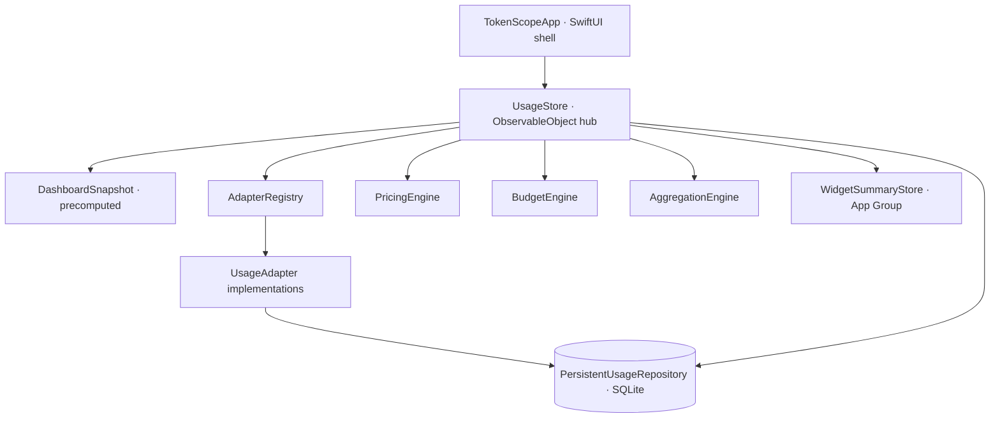

# TokenScope

> A local-first, native macOS app that tracks **token usage, estimated cost, trends and budgets** across local AI coding/chat tools. It reads local logs and SQLite databases only, aggregates everything on-device, and has **no upload path**.

<p>
  
  
  
  
  
  
</p>

---

## Table of contents

- [What it is](#what-it-is)
- [Features](#features)
- [Supported tools & data sources](#supported-tools--data-sources)
- [Install](#install)
- [Build from source](#build-from-source)
- [Development & test commands](#development--test-commands)
- [Architecture](#architecture)
- [Storage, dedup & incremental sync](#storage-dedup--incremental-sync)
- [Cost estimation & budgets](#cost-estimation--budgets)
- [Language (English / 中文)](#language-english--中文)
- [Token accuracy](#token-accuracy)
- [Performance](#performance)
- [Privacy & security](#privacy--security)
- [Project structure](#project-structure)
- [Version history](#version-history)
- [Known limitations / roadmap](#known-limitations--roadmap)
- [License](#license)

---

## What it is

**TokenScope** is for developers who use multiple AI agents / CLI tools and want one **unified, private** dashboard of token usage that is otherwise scattered across each tool's local logs and databases: today / week / month totals, estimated cost, trend charts, tool distribution, budget progress and recent activity.

It **only reads local files and local SQLite databases**, normalizes and aggregates everything on-device, and needs **no API key** to count usage. The UI is a light sci-fi glassmorphism dashboard and also ships a menu-bar mini panel plus WidgetKit widget source.

> The interface is **bilingual (English / 中文)** and defaults to **English**; switch it live in **Settings**. Internally, some enum `rawValue`s are still Chinese because they are persisted as SQLite keys — those are mapped to localized labels for display and never shown raw (see the conventions note under [Architecture](#architecture)).

---

## Features

- **Bilingual UI (English / 中文)** — English by default; switch language live in Settings and the choice is persisted.
- **Unified multi-tool tracking** — aggregates usage from Claude Code, Codex, Hermes, OpenClaw and OpenCode in one place.
- **Local-first, zero upload** — reads local logs / SQLite only; data stays on your machine. No telemetry, no upload path.
- **Incremental sync** — per-file resume cursors mean only newly appended data is parsed by default; a full re-read is one click away.
- **SQLite persistence** — normalized records, pricing, budgets and cursors are stored in SQLite (WAL). Records are keyed independently of sources/accounts, so historical usage survives source/account removal.
- **Cost estimation** — per-million-token pricing; when a source already reports cost (Hermes, OpenClaw, OpenCode), the source-provided cost is preferred.
- **Budget radar** — daily / weekly / monthly token and cost budgets, with a "by tokens" or "by cost" progress mode and 80% / 100% tiered alerts.
- **Trends & distribution** — hour/day/month-bucketed trend chart, tool distribution and cache-hit rate.
- **Cache-creation & request counts** — cache *creation* (write) is tracked separately from cache *read*, and request counts are aggregated per range/tool — surfaced on the dashboard, the Usage detail table and the tool distribution.
- **Menu bar + widgets** — a `MenuBarExtra` mini panel (shows today's tokens or today's cost); WidgetKit widget source is included.
- **Export** — CSV / JSON export that **redacts** account / API-key identifiers by default.

---

## Supported tools & data sources

Five built-in adapters:

| Tool | Data source | Type |
|---|---|---|
| **Claude Code** | `~/.claude/projects/**/*.jsonl` | JSONL, line-by-line |
| **Codex** | `~/.codex/sessions/**/*.jsonl`, `~/.codex/archived_sessions/*.jsonl` | JSONL (`token_count` events) |
| **Hermes** | `~/.hermes/state.db` | SQLite (`sessions` table, incl. `estimated_cost_usd`) |
| **OpenClaw** | `~/.openclaw/agents/*/sessions/*.jsonl` | JSONL (incl. `usage.cost.total`) |
| **OpenCode** | `~/.local/share/opencode/opencode.db` | SQLite (message rows, incl. cost fields) |

> **Adding a tool** (Cursor / OpenAI / Gemini …): add a `ToolKind` case in `Models.swift`, implement an adapter, register it in `AdapterRegistry`, and add default rows in `UsageStore.defaultPricing()`. JSONL-based tools can reuse `LocalJSONLUsageAdapter` by passing a parser closure.

---

## Install

### Option A — download a release (recommended for most users)

1. Grab the latest `TokenScope-<version>.dmg` or `TokenScope-<version>-macOS.zip` from [Releases](https://github.com/BennettL569/Token-UI-TokenScope/releases).
2. Open the `.dmg` and drag `TokenScope.app` into Applications (or unzip and drag it in).
3. **First launch (Gatekeeper)**: this build is **ad-hoc signed and not notarized by Apple**, so macOS blocks it the first time. Allow it one of two ways:
   - **No Terminal:** double-click it once and dismiss the warning, then open **System Settings → Privacy & Security**, scroll to the message about *TokenScope* and click **Open Anyway** → **Open**. _(On macOS 15+ the old right-click → Open shortcut no longer works — use this.)_
   - **Terminal:** remove the quarantine flag, then open it normally:

     ```bash
     xattr -dr com.apple.quarantine /Applications/TokenScope.app
     ```

> Requires **macOS 14+** on **Apple Silicon or Intel** — the release is a **universal binary**. The app is a **non-sandboxed** build so it can read local logs under `~/.claude`, `~/.codex`, etc. It is **not notarized** (no paid Apple Developer ID), which is why the first-launch step above is needed.

### Option B — build & install yourself

```bash
git clone https://github.com/BennettL569/Token-UI-TokenScope.git
cd Token-UI-TokenScope
packaging/build_app.sh          # → dist/TokenScope.app (universal arm64+x86_64, ad-hoc signed, non-sandboxed)
cp -R dist/TokenScope.app /Applications/
```

---

## Build from source

### Requirements

- macOS 14+
- Swift 6 (`swift-tools-version: 6.0`) — Xcode or Command Line Tools
- Links the system `sqlite3` (already configured in `Package.swift`)
- `hdiutil` to build a DMG, `codesign` to sign (both ship with macOS)

```bash
swift --version
```

### Build & run

```bash
swift build                                   # debug build of all products
swift run TokenScope                          # run the app (non-sandboxed; can read ~/.claude etc.)
swift build -c release --product TokenScope   # release build
```

### Package

```bash
packaging/build_app.sh    # → dist/TokenScope.app (universal arm64+x86_64 + .icns + ad-hoc signing; non-sandboxed/unnotarized)
packaging/build_dmg.sh    # → dist/TokenScope-<version>.dmg (universal; with an /Applications drag symlink)
```

> SwiftPM **cannot** build the WidgetKit extension. `TokenScope.xcodeproj` mirrors the same sources and is the **only** way to build `TokenScopeWidgetsExtension`. Note: the Xcode build enables App Sandbox (`files.user-selected.read-only` only), under which the home-directory log adapters cannot read — which is why `swift run` / `build_app.sh` produce **non-sandboxed** binaries.

---

## Development & test commands

There are **two parallel test suites** covering the same logic (update both when you change core logic):

```bash
# 1) Hand-rolled fast checker (no XCTest/Swift Testing runtime dependency)
swift run TokenScopeCoreTestsRunner
#    expected: TokenScopeCoreTestsRunner: 26 checks passed

# 2) Swift Testing suite
swift test
swift test --filter aggregationFiltersToday   # run a single test

# 3) Smoke test against real local data sources (runs twice to exercise incremental sync)
swift run TokenScopeSmoke
#    prints record counts and per-tool sync status for both passes
```

> No linter / formatter is configured.

---

## Architecture

Dependency direction, bottom-up:



### Modules

| Module | Role |
|---|---|
| `TokenScopeCore` (library, links `sqlite3`) | All logic, no SwiftUI: `Models/`, `Adapters/`, `Services/` (engines, import/export, keychain, config, widget summary), `Storage/`. Everything testable lives here. |
| `TokenScopeApp` (executable) | SwiftUI shell, depends on Core. Entry: `App.swift` + `AppDelegate.swift`. |
| `TokenScopeCoreTestsRunner` / `TokenScopeSmoke` (executables) | Verification / smoke harnesses. |
| `TokenScopeWidgets/` | WidgetKit source, compiled **only** by the Xcode `TokenScopeWidgetsExtension` target. |

### Runtime flow

`UsageStore` (`Storage/UsageStore.swift`) is the `ObservableObject` hub the whole UI binds to. It holds `records`, `pricing`, `budgets`, the active filters (time range / search / tool) and a precomputed `dashboardSnapshot`. Filter/range/budget changes trigger a snapshot rebuild via `didSet` — **the snapshot, not live filtering, is the dashboard's source of truth**.

`refreshAll(fullScan:)` is the sync entry point: for each enabled source it resolves an adapter from `AdapterRegistry` by `ToolKind`, calls `adapter.refresh(...)`, upserts results into `PersistentUsageRepository` (SQLite), reloads `records`, rebuilds the snapshot, and writes a `WidgetSummary` to the App Group.

### Adapter protocol

```swift
public protocol UsageAdapter: Sendable {
    var id: String { get }
    var tool: ToolKind { get }
    var displayName: String { get }
    var capabilities: AdapterCapabilities { get }
    func refresh(source: UsageSource,
                 pricing: [ModelPricing],
                 cursorStore: UsageCursorStore?,
                 fullScan: Bool) async throws -> [UsageRecord]
}
```

Two reusable adapter shapes: `LocalJSONLUsageAdapter` (a generic line-by-line JSONL reader taking a `parser` closure) and SQLite adapters (`HermesSQLiteUsageAdapter`, `OpenCodeSQLiteUsageAdapter`, opened read-only).

### Conventions & gotchas

- **Chinese enum `rawValue`s are persisted keys, not just labels.** For example `BudgetPeriod.daily = "每日"` is a SQLite primary key; `ToolKind` / `TimeRange` / `BudgetProgressMode` raw values appear in the DB and in CSV export. Changing a `rawValue` silently breaks stored data and dedup keys — migrate, don't rename casually.

---

## Storage, dedup & incremental sync

### Location

```text
~/Library/Application Support/TokenScope/usage.sqlite   # WAL mode
```

Tables: `usage_records`, `model_pricing`, `budget_rules`, `refresh_cursors`. A legacy `usage-records.json` is auto-migrated once on first open.

### Dedup

`UsageRecord.dedupeKey` is the primary key of `usage_records`; upserts overwrite:

- with a request id: `source::request::<requestId>`
- otherwise: `source::fallback::sha256(timestamp|model|tokens|source|rawSource)`

Because the key is independent of source/account, **historical usage survives source or account removal**. `totalTokens = input + output + cache`, computed in the initializer.

### Incremental sync (cursors)

`refresh_cursors` stores a per-file resume point:

- **JSONL adapters** store a byte offset (file size) and seek past it next time → only newly appended lines are parsed.
- **SQLite adapters** store a timestamp and query rows newer than `cursor − 24h` (the lookback absorbs late-written rows).
- `fullScan: true` clears/ignores cursors; the default refresh is incremental.

---

## Cost estimation & budgets

Cost is estimated with per-million-token pricing:

```text
cost = inputTokens  / 1_000_000 * inputPrice
     + outputTokens / 1_000_000 * outputPrice
     + cacheTokens  / 1_000_000 * cachePrice
```

Matching order is `(tool, model)` → `(model)` → a hardcoded fallback. **Source-provided cost is preferred when present** (Hermes `estimated_cost_usd`, OpenClaw `usage.cost.total`, OpenCode cost fields). Money is `Decimal` internally, bridged to `Double` only for SQLite / SwiftUI. You can add, update or delete model pricing on the **Pricing** screen (persisted to SQLite).

Budget progress has two modes (toggle in-app):

- **Tokens** — used total tokens / token budget
- **Cost** — estimated cost / cost budget

Alert levels: `< 0.8` normal · `< 1` warning · `≥ 1` exceeded.

---

## Language (English / 中文)

The whole interface is available in **English** (default) and **中文**. Switch it live under **Settings → Language**; the choice is saved to `UserDefaults` and applied immediately to every view (including the menu-bar panel). Time ranges, budget periods and progress modes have localized labels while their persisted SQLite keys stay unchanged.

---

## Token accuracy

Token counting is normalized to **disjoint `input` + `output` + `cache` buckets that sum to the total**, matching each tool's own accounting:

- **Claude Code** — `cache_creation_input_tokens` is the canonical cache-creation total; its `cache_creation.ephemeral_*` breakdown is no longer added on top (it previously double-counted cache, inflating totals).
- **Codex** — follows OpenAI accounting where `total = input + output`: `cached_input_tokens` is split out of `input` (instead of added on top) and `reasoning_output_tokens` is kept inside `output` (instead of added again). This removes a large over-count on big sessions.
- **OpenCode / Hermes (SQLite)** — WAL-mode databases are now opened robustly: a plain read-only open of a WAL database whose `-wal`/`-shm` sidecars are absent (the writing app isn't running) used to fail and **silently drop that tool's usage**; it now falls back to an immutable read.
- On first launch after upgrading, a one-time full rescan re-derives historical records with the corrected math (tracked by an internal parser version); afterwards, incremental sync is unaffected.

---

## Performance

The app does heavy work (parsing potentially **gigabytes** of local logs) without blocking the UI. Beyond the v1.0.1 dashboard work, v1.1.0 makes a full rescan dramatically cheaper:

- **Parsing** — JSONL parsers gate on a cheap substring before the full JSON decode (e.g. only Codex `token_count` lines are decoded), and the ISO-8601 date formatters are created once instead of per line. Together these cut a multi-gigabyte rescan from minutes toward seconds of CPU.
- **Persistence** — batch upserts reuse one prepared statement inside a single transaction instead of re-compiling SQL and running an implicit transaction per row.
- **Dashboard snapshot** — the snapshot (base today/week/month/all aggregates, trend bucketing, and the filtered selection) is recomputed **off the main thread and coalesced**, so changing the range, custom dates, search or tool never blocks the UI — a filter change costs ~0 ms on the main thread instead of ~25–30 ms over a large record set. The base aggregates use one precomputed-bounds pass instead of several `Calendar`-membership passes, and the search field and custom date pickers are debounced to avoid spawning redundant background recomputes.
- **Off-main refresh/persistence** — log parsing, upsert, full-table reload and widget-summary aggregation run off the main thread, so launch/refresh and the one-time corrective rescan never freeze the UI.
- **Window configuration** — windows are configured once instead of on every AppKit `applicationDidUpdate` tick.

---

## Privacy & security

- Reads local files and local SQLite only — **no telemetry / upload path**.
- Counting usage **does not require an API key**.
- The UI shows only account / API identity labels or masked values; real keys go through macOS Keychain via `KeychainService`.
- Export **redacts** account / API-key identifiers by default.

---

## Project structure

```text
Token-UI-TokenScope/
├── Package.swift
├── Sources/
│   ├── TokenScopeApp/            # SwiftUI shell (App / AppDelegate / Views / Theme)
│   ├── TokenScopeCore/           # logic core
│   │   ├── Adapters/             # UsageAdapter + per-tool adapters and parsers
│   │   ├── Models/               # Models.swift
│   │   ├── Services/             # Engines / ImportExport / Keychain / WidgetSummary / Config
│   │   └── Storage/              # UsageStore / PersistentUsageRepository
│   ├── TokenScopeCoreTestsRunner/
│   └── TokenScopeSmoke/
├── Tests/TokenScopeTests/        # Swift Testing suite
├── TokenScopeWidgets/            # WidgetKit source (Xcode build only)
├── TokenScope.xcodeproj/         # mirrors the sources; only way to build the widget extension
├── Config/                       # entitlements / widget Info.plist
├── packaging/                    # build_app.sh / build_dmg.sh
├── docs/ARCHITECTURE.md
└── dist/                         # build output (git-ignored)
```

---

## Version history

| Version | Notes |
|---|---|
| **v1.1.4** | Fix Codex usage being recorded under the model name `codex`: the real model (e.g. `gpt-5.5`, `gpt-5.4`, `gpt-5.4-mini`) is now read from each turn's `turn_context` event and carried onto the token-count records — including across incremental syncs, where the model is persisted alongside the resume cursor. Adds default pricing for the new Codex models (seeded for upgrading users without overwriting edited or deleted prices) and a one-time corrective rescan on first launch. |
| **v1.1.3** | New statistics: **cache creation** (write) tokens tracked separately from cache read, and **request counts** per range/tool — shown on the dashboard, the Usage detail table and the tool distribution. Adds an auto-migrated `cache_creation_tokens` column and a one-time backfill rescan on first launch. Also adds a **delete** action (with confirmation) to the Pricing screen so manually added prices can be removed. |
| **v1.1.2** | Ship a **universal binary** (arm64 + x86_64) so the release runs on both Apple Silicon and Intel Macs. Update the install docs for macOS 15+/26 Gatekeeper (System Settings → Open Anyway / `xattr`). No code changes. |
| **v1.1.1** | Fix dropped frames when changing the time range or custom dates: the dashboard snapshot is recomputed off the main thread (coalesced), so a filter change costs ~0 ms on the main thread instead of ~25–30 ms. Also debounce the date pickers and precompute custom-range bounds. |
| **v1.1.0** | Bilingual UI (English default + 中文, live switch). Token-accuracy fixes (Claude cache double-count; Codex cached/reasoning de-dup) with a one-time corrective rescan. Fix WAL-mode SQLite read-only open that silently dropped OpenCode/Hermes usage. Faster rescans (substring-gated parsing, cached date formatters, batched transactional upserts, single-pass base aggregates, debounced search). |
| **v1.0.1** | Performance: eliminate dashboard frame drops (snapshot caching + single-pass + precomputed bounds); configure windows once; move refresh/persistence off the main thread. |
| **v1.0.0** | Initial release: 5-tool adapters, SQLite persistence, cost estimation, budgets, export, menu bar, WidgetKit source. |

See the [commit history](https://github.com/BennettL569/Token-UI-TokenScope/commits/main) and [Releases](https://github.com/BennettL569/Token-UI-TokenScope/releases) for full details.

---

## Known limitations / roadmap

- The app is **ad-hoc signed and not notarized**; public distribution needs an Apple Developer ID certificate + `notarytool` notarization.
- The WidgetKit widget must be built in an Xcode Widget Extension target (with a matching App Group); SwiftPM does not build it.
- Data source / account configuration is not persisted yet (historical usage is).
- Planned: CSV import UI, SQLite-backed export history, local budget-threshold notifications, more adapters (Cursor / OpenAI / Gemini …), Developer ID signing & notarization.

---

## License

Licensed under the **GNU General Public License v3.0** (GPL-3.0). See [LICENSE](LICENSE) for the full text.
