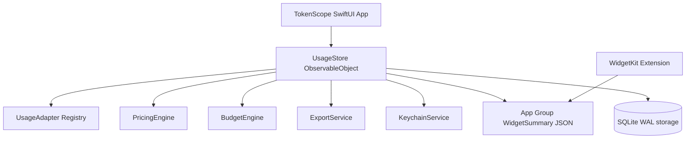

# TokenScope Product & Technical Architecture

> ⚠️ **Historical design note.** This document captures the original prototype design. Several
> details are now out of date — storage is **SQLite (WAL)**, not in-memory; there are **5 tools**
> (ClaudeCode, CodeX, Hermes, OpenClaw, **OpenCode**); adapters read **real** local logs/DBs (no
> mocks); and the in-app updater exists. For the current architecture, treat the **README** as the
> canonical reference. The conceptual sections below (data models, cost, budgets, widgets) still
> hold.

## Repository Analysis

TokenScope is a modular Swift Package macOS app that can be opened in Xcode or built with SwiftPM.
The implementation keeps production logic testable outside the SwiftUI shell.

## Product Scope

TokenScope is a local-first macOS native dashboard for tracking API token usage across AI coding/conversation tools:

- ClaudeCode
- CodeX
- Hermes
- OpenClaw
- OpenCode

Core surfaces:

1. Dashboard overview
2. Usage detail table
3. Data source management
4. Account/API identity settings
5. Model pricing settings
6. Budget settings
7. Export/import
8. Security/local data controls
9. Widget guidance and shared summaries
10. Menu bar mini panel

## Architecture



Records, pricing, budgets and refresh cursors persist in **SQLite (WAL)** via `PersistentUsageRepository`; an in-memory repository remains only for tests. (The original prototype used an in-memory store with mock records — that has been superseded.)

## Data Models

- `UsageRecord`: normalized usage row with source, accountId, apiKeyHash, model, timestamp, token counts, estimatedCost, requestId, dedupeKey, rawSource.
- `UsageSource`: configured data source including local log path/API identity/enabled state/sync status.
- `Account`: account identity per tool.
- `APIKeyIdentity`: masked API key metadata; secrets belong in Keychain.
- `ModelPricing`: input/output/cache token unit prices per million tokens.
- `BudgetRule`: daily/weekly/monthly token and cost budgets.
- `AggregatedUsage`: grouped summary for dashboards and widgets.
- `SyncStatus`: idle/syncing/success/warning/failed.
- `WidgetSummary`: compact App Group payload.

## Adapter Architecture

All data sources implement `UsageAdapter`:

```swift
protocol UsageAdapter {
    var id: String { get }
    var tool: ToolKind { get }
    var displayName: String { get }
    var capabilities: AdapterCapabilities { get }
    func refresh(source: UsageSource, pricing: [ModelPricing], cursorStore: UsageCursorStore?, fullScan: Bool) async throws -> [UsageRecord]
}
```

Capabilities declare:

- `supportsLiveAPI`
- `supportsLocalLogs`
- `supportsImport`
- `supportsCostEstimation`

Adapters are isolated and registered by `AdapterRegistry`. Adding Cursor/OpenAI/Gemini/DeepSeek/Anthropic Console means adding a new adapter type without touching existing adapters.

Adapters read real local data: `LocalJSONLUsageAdapter` (ClaudeCode, CodeX, OpenClaw) parses JSONL line-by-line, while `HermesSQLiteUsageAdapter` and `OpenCodeSQLiteUsageAdapter` read SQLite databases read-only. All normalize into `UsageRecord` and share the dedupe/cost paths.

## Dedupe Strategy

- If request id exists: `source + requestId`
- Otherwise: hash of `timestamp + model + token counts + raw source/source name`

The store keeps one row per dedupe key.

## Cost Estimation

`PricingEngine` computes:

```text
cost = inputTokens / 1_000_000 * inputPrice
     + outputTokens / 1_000_000 * outputPrice
     + cacheTokens / 1_000_000 * cachePrice
```

Prices are user-editable in UI. Summaries aggregate cost by tool/account/model/time range.

## Time Range & Trends

Supported ranges:

- Today: hourly trend buckets
- This week: daily buckets
- This month: daily buckets
- All: monthly buckets

Trend buckets track input/output/cache/total tokens.

## Budget Alerts

Budgets exist for daily/weekly/monthly:

- token budget
- cost budget

Alert levels:

- `<80%`: normal
- `80–99.99%`: warning
- `>=100%`: exceeded

The dashboard and menu bar panel show progress. Local notifications are represented as a product-ready extension point.

## Privacy & Security

- API keys are stored through `KeychainService`.
- UI displays masked identities only, e.g. `sk-...abcd`.
- No upload path exists by default.
- Import/export are local file operations.
- Export UI includes an explicit include/exclude account/API identifiers option.
- Local data clearing is exposed in Security settings.

## WidgetKit Design

Widget extension reads `WidgetSummary` JSON from App Group shared storage.

- Small: today total tokens + budget progress
- Medium: today/week tokens, cost, compact trend
- Large: tool/model distribution, budget progress, last update

Widget contains no full API key and routes complex configuration back to the main app.

## UI Design System

- Dark sci-fi dashboard
- Neon cyan/blue/purple accents
- Glass panels with subtle borders
- 8px-ish corner radii
- Hierarchical large numbers
- Tables and forms optimized for resize
- Empty/error/loading states included

## Verification Plan

- `swift test` for pricing, aggregation, dedupe, masking, import/export JSON/CSV.
- `swift build` for package build.
- Manual/Xcode run for visual QA if full app bundle signing/widget entitlement is required.
